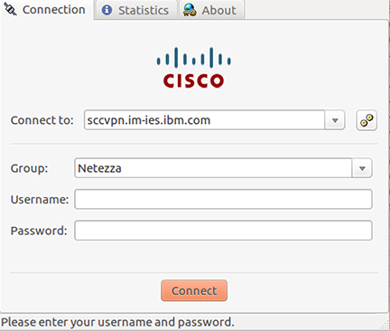
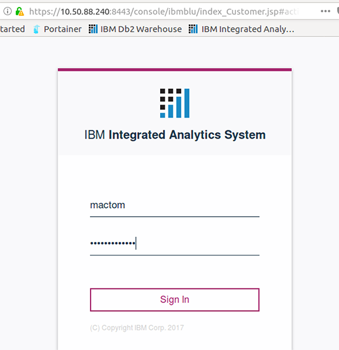
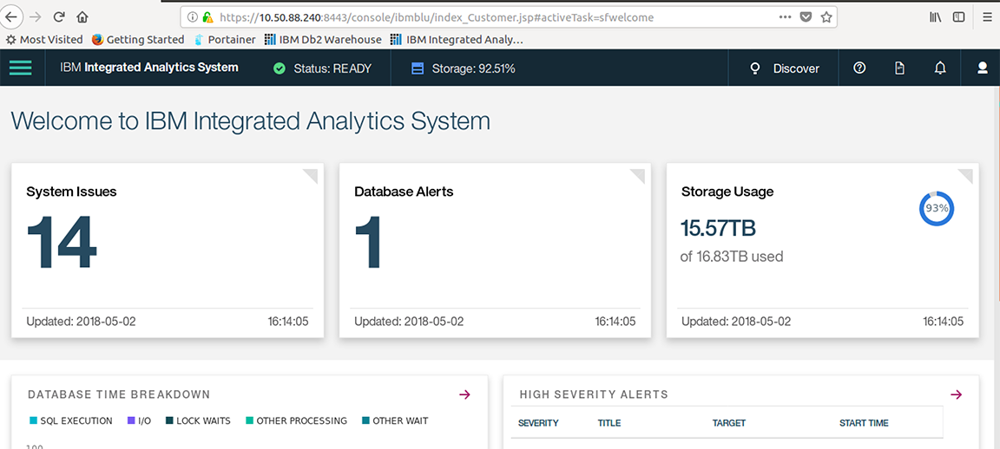
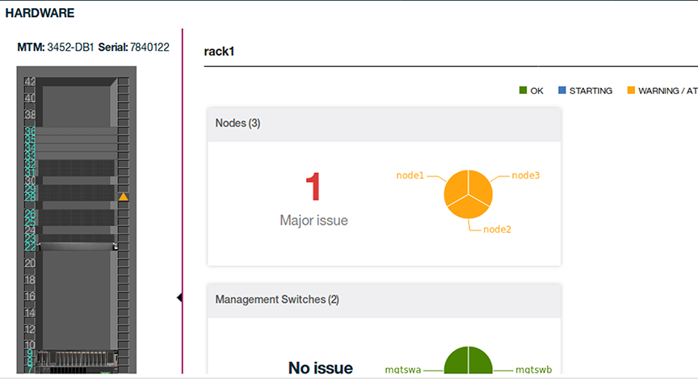
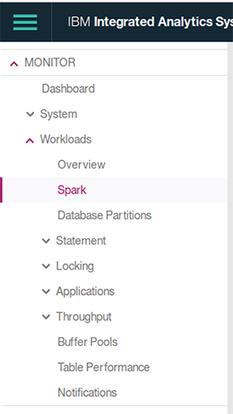
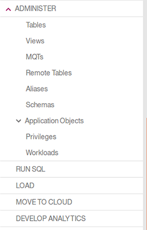
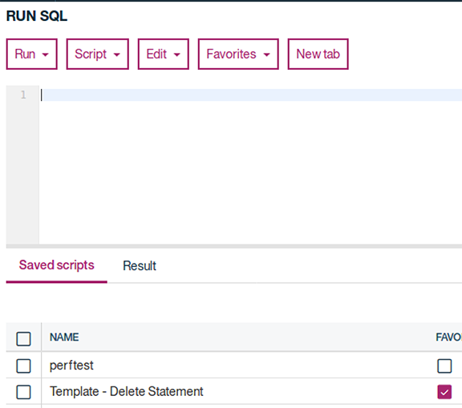
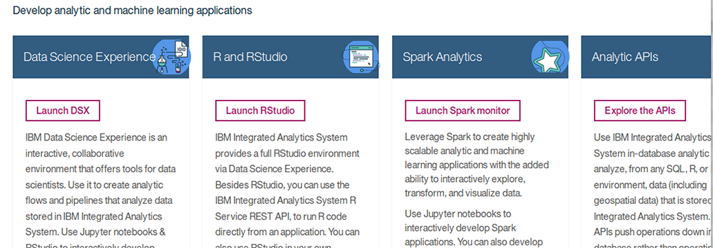
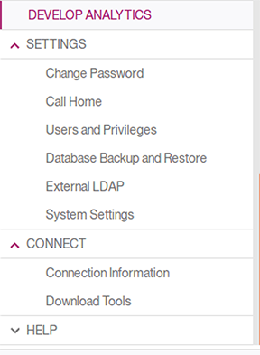

#   IBM Integrated Analyics System - Administration  

## This will be the admin lab to explore the administration of IIAS.

1. From the Virtual Machine, launch the Cisco VPN 
    * Verify that `sccvpn.im-ies.ibm.com` is in the **Connect to:** Box
    * Click **Connect** button.
      >
    * Enter your VPN user id and password.  **Note:** If you do not have this id, follow the [partner access document](../../../PartnerAccess.md)
      >
1. From the Virtual Machine launch Firefox.
1. Bookmarked you will find a link to https://10.50.88.240:8443/console  
     >
1. Login with user/password provided by the instructor. If you are running this outside of class, use your id provided.
    *  Note: This interface is very similar to Db2 Warehouse and DSX Local, as they are all build with Data Server Manager as the admin UI.  
     >

## Review the Dashboard
1. Across the masthead: (from left to right)
   
    * Click the Flag box in the upper left.  This is a menu.
    * Click **IBM Integrated Analytics System**  This will always bring you back to the main Dashboard page.
    * Click **Status**.  This gives you a finer grained overall status.
    * Click **Storage** indicator.   This gives you breakdown of the storage.
    * Clicking **Discover** will give you guided tour of the admin console
    * Clicking the **?** provides online help
    * Clicking the **book** at the far right gives you the documents for the system
1.  Below the masthead are tiles that you can drill down into to discover what is available and interesting.  ***Note:*** Each one can be drilled down into.
1. Click the Menu and review each of topics in the menu.
    * Expanding `Monitor > System > Hardware`, note the picture of the machine and the warning areas are indicated on the graphic.  This is so someone servicing the system can tell where on the rack you are having an issue.
     >
1. Here is a view on the **Monitor** options:
     >
1. Here is a view of the databse administration. Here you can review the systems schemas, tables, priviledges, workloads, etc.
     >
1. Below Adminster, is **Run SQL**.  This will give you a window to query your schemas, drop tables, etc.
     >
1. Below Run SQL is **Load**, which allows you to drag and drop data sets to be loaded into the system.
1. **Move to cloud**. provides a client to Lift that provides very fast uploads via the Lift service to the IBM Cloud.
1. **Develop Analytics**, links you to the build in Data Science tooling in IIAS.
     >
1. Expanding the **Settings** area, will show you were you can connect and external LDAP to the system, create and delete users to the system, perform back up and restores
    * **Call Home** function provides a simple, quick secure way to send system information to IBM.  Very helpful with support.
    >
1. Last but not least is the **Connect** and **Help** areas that will give you connection information for any clients and access to help, similar to the mast head help.
